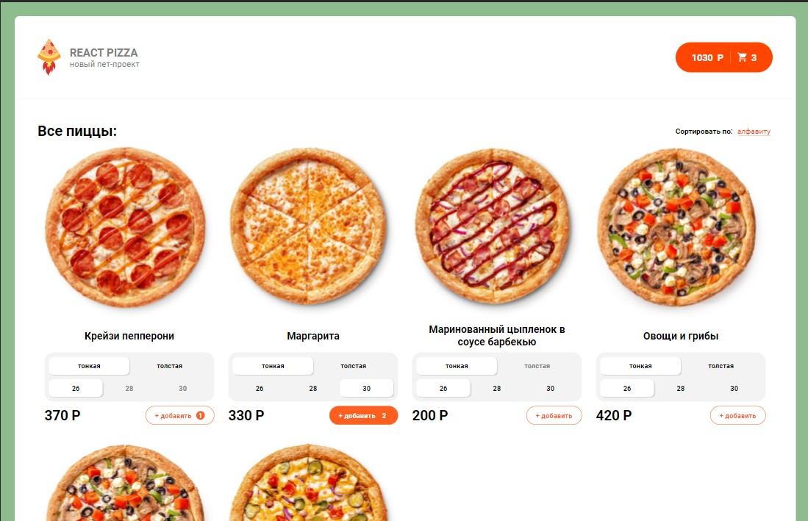

##React-app

### Для создания приложения использовались следующие технологии:
HTML5, SCSS, JS, React, React-router-dom, Redux, React-redux, Redux-thunks, Redux-devtools, Axios, JSON-server.

### Чтобы развернуть приложение, необходимо:

1 - установить все зависимости

### `npm install`

2 - запустить проект

### `npm run serve`

### Приложение будет доступно по ссылке:

### `http://localhost:3000/`

